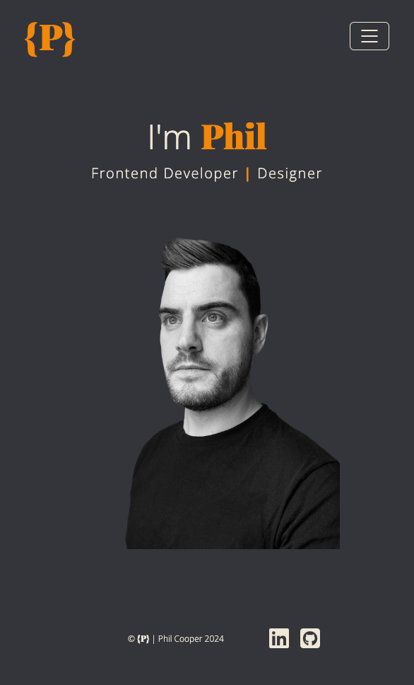
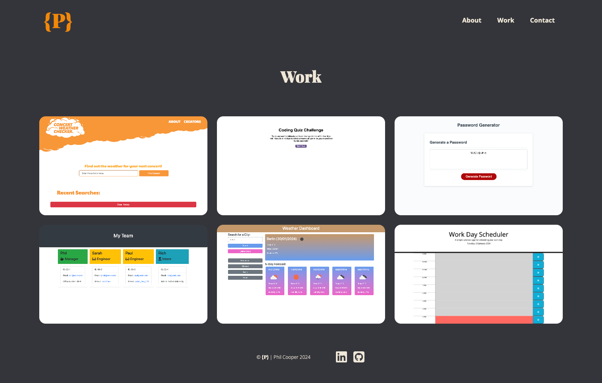
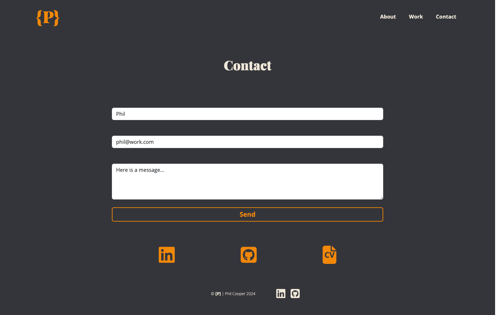

## License

# React Portfolio

Personal portfolio built using React

## Table of Contents

- [Description](#description)
- [Usage](#usage)
- [License](#license)
- [Images](#images)
- [Questions](#questions)

## Description

Using React I have created my personal portfolio. SHowcasing all of tmy project so far. This will be something I will continually update.

Here is a list of languages/technologies used:

- JavaScript
- Node.js
- NPM
- React
- Bootstrap

## Usage

You can view the live site [here](https://phil-dev.netlify.app/)

## Images

Here are a few screenshots of the website.

#### Home page on mobile

#### Work page

#### Contact page

## Questions

Any questions? Contact me [here](https://github.com/PhilC7).
